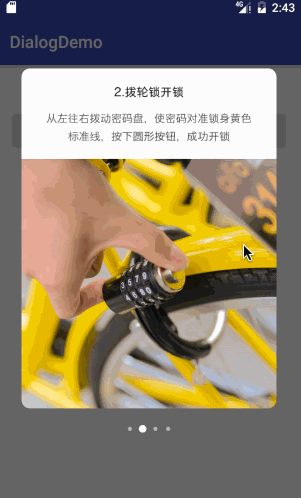
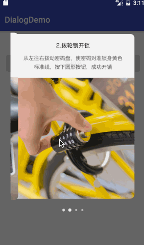
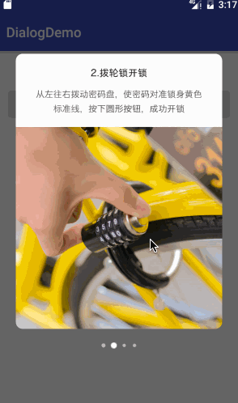

# StepDialog
一行代码实现ofo app首次注册时的步骤控件

# Preview


# Gradle
```
dependencies {
    compile 'compile 'com.zqg:library:1.0.0'
}
```

# Usage
```
StepDialog.getInstance()
                .setImages(new int[]{R.drawable.new_user_guide_1, R.drawable.new_user_guide_2, R.drawable.new_user_guide_3, R.drawable.new_user_guide_4})
                .show(getFragmentManager());
```

# API
| API           | 释义           |
| ------------- |:-------------:|
| setPageTransformer      | ViewPager切换动画方式，分为DepthPageTransformer和ZoomOutPageTransformer两种方式 |
|   setCanceledOnTouchOutside    | 点击四周是否取消dialog,默认取消      | 
| setOutsideIsTransparent | 设置背景四周是否透明,调用时需要放到show方法后面      |

## ViewPager的两种切换方式
### DepthPageTransformer方式


### ZoomOutPageTransformer方式


# License

```
The MIT License (MIT)

Copyright (c) 2016 ldoublem

Permission is hereby granted, free of charge, to any person obtaining a copy
of this software and associated documentation files (the "Software"), to deal
in the Software without restriction, including without limitation the rights
to use, copy, modify, merge, publish, distribute, sublicense, and/or sell
copies of the Software, and to permit persons to whom the Software is
furnished to do so, subject to the following conditions:

The above copyright notice and this permission notice shall be included in all
copies or substantial portions of the Software.

THE SOFTWARE IS PROVIDED "AS IS", WITHOUT WARRANTY OF ANY KIND, EXPRESS OR
IMPLIED, INCLUDING BUT NOT LIMITED TO THE WARRANTIES OF MERCHANTABILITY,
FITNESS FOR A PARTICULAR PURPOSE AND NONINFRINGEMENT. IN NO EVENT SHALL THE
AUTHORS OR COPYRIGHT HOLDERS BE LIABLE FOR ANY CLAIM, DAMAGES OR OTHER
LIABILITY, WHETHER IN AN ACTION OF CONTRACT, TORT OR OTHERWISE, ARISING FROM,
OUT OF OR IN CONNECTION WITH THE SOFTWARE OR THE USE OR OTHER DEALINGS IN THE
SOFTWARE.
```